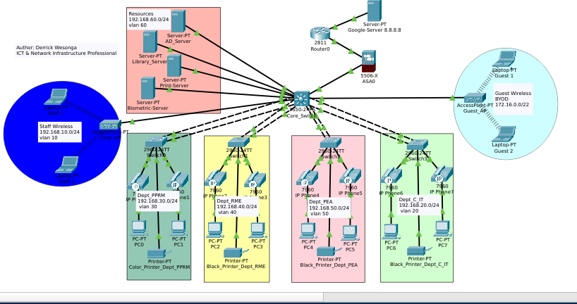

# Enterprise Core–Access Infrastructure

Production-grade enterprise network architecture implementing a resilient hierarchical Core-Access design with Layer 3 inter-VLAN routing, EtherChannel redundancy, Cisco ASA security enforcement, centralized AD-managed DHCP/DNS services, and Cisco CME VoIP infrastructure for secure, scalable, and highly available multi-department operations.

---
# 🖼️ Enterprise Topology Diagram



---

# 📌 Project Overview

This project demonstrates the design and implementation of a secure and resilient enterprise network infrastructure based on Cisco networking technologies. The environment was architected using a hierarchical Core-Access model to ensure scalability, redundancy, simplified management, and optimized traffic flow across multiple organizational departments.

# Project Vision

This project was designed to simulate a production-grade enterprise campus infrastructure capable of supporting secure multi-department operations, centralized services, VoIP communications, and scalable future expansion.

# 📊 Business Outcomes

This infrastructure improves:

- Departmental security through VLAN isolation
- Service continuity through redundant uplinks
- Operational efficiency via centralized DHCP/DNS
- Communication reliability using dedicated VoIP infrastructure
- Administrative scalability through centralized management
- Fault tolerance and reduced downtime

# Engineering Goals vs Strategic Impact

| Engineering Goal | Strategic Impact |
|---|---|
| EtherChannel Redundancy | Prevents departmental outages during link failures |
| VLAN Segmentation | Enhances security and reduces broadcast traffic |
| Centralized DHCP/DNS | Simplifies infrastructure administration |
| Voice VLAN Deployment | Ensures reliable enterprise VoIP communication |
| ASA ACL Enforcement | Prevents unauthorized lateral movement |

# ⭐ Technical Highlights

- Multi-VLAN enterprise segmentation
- Layer 3 inter-VLAN routing
- EtherChannel redundancy (LACP)
- Cisco ASA perimeter firewalling
- Dynamic NAT/PAT implementation
- Cisco CME VoIP deployment
- Active Directory-integrated DHCP/DNS
- Enterprise VoIP provisioning via TFTP
- STP PortFast optimization
- Centralized service delivery architecture

# Design Philosophy

## Security-First Architecture
Implemented VLAN isolation, ACL enforcement, and ASA perimeter inspection to reduce lateral movement and protect internal resources.

## High Availability & Redundancy
Integrated EtherChannel (LACP) uplinks and structured Layer 3 routing to eliminate single points of failure.

## Unified Communications
Dedicated Voice VLAN architecture ensures reliable VoIP communication without degrading data services.

## Scalable Enterprise Design
Hierarchical Core–Access structure enables future departmental growth without requiring major redesign.

The infrastructure integrates:

* Layer 3 inter-VLAN routing
* Cisco ASA perimeter security
* VLAN segmentation
* Dynamic NAT
* EtherChannel redundancy
* VoIP telephony services
* Centralized DHCP/DNS services
* Active Directory integration
* Enterprise endpoint connectivity
* Network performance optimization

The project simulates a real-world enterprise environment supporting voice, data, centralized services, and secure external connectivity.

---

# 🏗️ Network Architecture

## Hierarchical Core–Access Design

The infrastructure follows a two-tier enterprise architecture:

### Core Layer

Handled by a Cisco Layer 3 Core Switch responsible for:

* Inter-VLAN routing
* Traffic aggregation
* Default gateway services
* High-speed switching
* EtherChannel aggregation
* Network segmentation

### Access Layer

Departmental access switches provide:

* Endpoint connectivity
* Voice VLAN access
* PortFast-enabled interfaces
* Trunk uplinks to the Core
* Department isolation

---

# 🔐 Security Architecture

Security is enforced using a Cisco ASA firewall positioned between the internal enterprise network and external connectivity.

## Security Features

### VLAN Segmentation

Logical isolation between departments:

| VLAN    | Department     |
| ------- | -------------- |
| VLAN 10 | Staff_Wireless |
| VLAN 20 | DeptC          |
| VLAN 21 | IT             |
| VLAN 30 | PPRM           |
| VLAN 40 | RME            |
| VLAN 50 | PEA            |
| VLAN 60 | Servers        |
| VLAN 70 | Guest_Wireless |
| VLAN 80 | Voice          |

---

### Cisco ASA Firewall

Implemented:

* Security zones
* ACL enforcement
* Dynamic NAT
* Guest isolation
* Traffic inspection
* Controlled inter-network communication

### Key Security Policies

#### Guest Isolation

Guests on `172.16.0.0/22` are blocked from accessing internal corporate networks.

```bash
access-list GUEST_BLOCK extended deny ip 172.16.0.0 255.255.252.0 192.168.0.0 255.255.0.0
access-list GUEST_BLOCK extended permit ip any any
```

#### IT Administrative Access

Dedicated IT subnet granted privileged access for management and troubleshooting.

---

# 📡 Redundancy & High Availability

## EtherChannel (LACP)

Implemented aggregated uplinks between the Core Switch and departmental access switches using LACP Port-Channels.

### Benefits

* Increased bandwidth
* Link redundancy
* Load balancing
* Fault tolerance

If one physical uplink fails, connectivity remains active through remaining links.

---

# ☎️ VoIP Infrastructure

The enterprise network includes a fully integrated Cisco CME (Call Manager Express) telephony environment.

## VoIP Components

* Dedicated Voice VLAN (VLAN 80)
* Cisco 2811 CME Router
* IP Phone auto-registration
* TFTP-based provisioning
* Extension assignment
* Voice/data separation

## 🎙️ Quality of Service (QoS)

Voice traffic was logically separated using VLAN 80 to minimize congestion and improve call quality.

QoS design considerations included:

- Dedicated Voice VLAN
- Traffic isolation from user data
- Reduced broadcast interference
- Prioritized voice signaling and RTP traffic

## Implemented Extensions

| Extension | Purpose      |
| --------- | ------------ |
| 1001      | Office Phone |
| 1002      | Office Phone |
| 1003      | Office Phone |
| 1004      | Office Phone |
| 1005      | Office Phone |
| 1006      | Office Phone |
| 1007      | Office Phone |
| 1008      | Office Phone |

---

## CME Configuration Example

```bash
telephony-service
 max-ephones 10
 max-dn 10
 ip source-address 192.168.80.254 port 2000
 auto assign 1 to 8
```
---

# 🌐 Centralized Services

An Active Directory server provides centralized enterprise services.

## Services Provided

### DHCP

Dynamic IP assignment across all VLANs.

### DNS

Internal name resolution using:

```text
.company.local
```

### User & Resource Management

Managed centrally using Active Directory.

---

# ⚡ Performance Optimization

## Implemented Enhancements

### STP PortFast

Enabled on all endpoint-facing interfaces to eliminate unnecessary startup delays.

### VLAN Traffic Isolation

Reduced broadcast domains and improved performance.

### Layer 3 Routing

Efficient inter-department communication handled directly at the Core.

---

# 🛡️ Security Hardening

Implemented enterprise-grade security controls including:

- VLAN isolation and broadcast containment
- Stateful firewall inspection on Cisco ASA
- ACL-based traffic filtering
- Guest network isolation
- Dynamic NAT/PAT
- Restricted administrative access
- Voice/Data traffic separation
- Endpoint segmentation

---

# Infrastructure Stack

| Layer | Technologies |
|---|---|
| Core Infrastructure | Cisco Catalyst 3650 |
| Perimeter Security | Cisco ASA 5506-X |
| Edge Routing & CME | Cisco 2811 |
| Routing | Inter-VLAN Routing, Static Routing |
| Redundancy | EtherChannel (LACP) |
| Security | ACLs, NAT, Stateful Inspection |
| Unified Communications | Cisco CME, SCCP |
| Core Services | Active Directory, DHCP, DNS |
| Access Layer | STP PortFast, Voice VLANs |
| Simulation Platform | Cisco Packet Tracer |

---

# 📂 Repository Structure

```text
.
└── Enterprise-campus-network-architecture
    |
    |-- README.md
    ├── Assets
    │   └── Screenshorts
    │       ├── DHCP_Pool_1.png
    │       ├── DHCP_Pool_2.png
    │       └── DNS_Services.png
    ├── configs
    │   ├── access-switches
    │   │   ├── pprm_switch.txt
    │   │   ├── rme_switch.txt
    │   │   └── voice_vlan_config.txt
    │   ├── core-switch
    │   │   ├── etherchannel_config.txt
    │   │   ├── svi_routing.txt
    │   │   └── vlan_config.txt
    │   ├── edge-router
    │   │   ├── cme_config.txt
    │   │   ├── static_routes.txt
    │   │   └── telephony_service.txt
    │   └── firewall
    │       ├── acl_policies.txt
    │       ├── asa_interfaces.txt
    │       └── nat_config.txt
    ├── documentation
    │   ├── future_scalability.md
    │   ├── implementation_sequence.md
    │   ├── InterfaceConfiguration.md
    │   └── network_design_decisions.md
    ├── monitoring
    │   ├── troubleshooting_guide.md
    │   └── validation_commands.md
    ├── security
    │   ├── acl_matrix.md
    │   ├── guest_isolation.md
    │   └── nat_policies.md
    ├── services
    │   ├── ad_structure.md
    │   ├── dhcp_scopes.md
    │   └── dns_records.md
    └── topology
        └── Enterprise_architecture.png
        
```

---

# 🚀 Deployment Sequence

## Phase 1 - Core Infrastructure

* Configure VLANs
* Configure SVIs
* Enable IP routing
* Configure EtherChannels

## Phase 2 - Access Layer

* Configure trunk links
* Configure access ports
* Configure Voice VLANs
* Enable PortFast

## Phase 3 - Security

* Configure ASA interfaces
* Configure NAT
* Apply ACLs
* Enforce segmentation

## Phase 4 - Centralized Services

* Configure DHCP scopes
* Configure DNS records
* Configure helper addresses

## Phase 5 - VoIP

* Configure CME
* Configure ephones
* Generate CNF files
* Register IP phones

---

# 🔍 Troubleshooting & Validation

## Validation Commands

### Core Switch

```bash
show vlan brief
show etherchannel summary
show ip route
```

### ASA Firewall

```bash
show access-list
show nat
show route
```

### CME Router

```bash
show ephone registered
show running-config
```

---

# Why This Architecture Matters

This project demonstrates how enterprise infrastructures balance:

- Performance
- Security
- Availability
- Scalability
- Centralized Management
- Unified Communications

The implementation reflects real-world enterprise networking principles used in modern government and corporate environments.

---

# 🔧 Operational Challenges Solved

- Eliminated single points of failure using EtherChannel
- Prevented unauthorized guest access to internal resources
- Reduced endpoint onboarding delays with STP PortFast
- Centralized IP allocation across isolated VLANs
- Resolved IP phone registration and provisioning issues
- Improved scalability through hierarchical segmentation

---

# 📈 Key Engineering Achievements

- Implemented resilient EtherChannel uplinks between Core and Access layers
- Secured guest traffic using ASA ACL isolation policies
- Centralized inter-VLAN routing on the Core switch
- Automated VoIP provisioning using Cisco CME and TFTP
- Integrated centralized DHCP/DNS services across all VLANs
- Optimized endpoint onboarding using STP PortFast

---

# 🎯 Learning Objectives Demonstrated

This project demonstrates practical implementation skills in:

* Enterprise Network Design
* Cisco Routing & Switching
* Network Security
* Firewall Administration
* VoIP Infrastructure
* VLAN Segmentation
* DHCP/DNS Integration
* Network Redundancy
* Infrastructure Troubleshooting

---

# 🚀 Future Enterprise Enhancements

- OSPF dynamic routing migration
- HSRP gateway redundancy
- AAA integration with RADIUS/TACACS+
- QoS traffic shaping and prioritization
- SNMP monitoring integration
- Syslog centralized logging
- IPv6 dual-stack deployment
- SD-WAN branch integration
- VPN remote-access services

---

# 📜 License

This project is intended for educational, research, and enterprise network architecture demonstration purposes.

---

# Quote by Author
"Connectivity is a commodity; continuity is an engineering masterpiece. Behind every efficient organization is infrastructure engineered for performance, protected for resilience, and designed for growth.”

---

# 👨‍💻 Author

Designed and implemented by *Derrick Nyongesa Wesonga* | ICT & Network Infrastructure professional specializing in enterprise systems, VoIP infrastructure, and resilient Cisco-based architectures.

